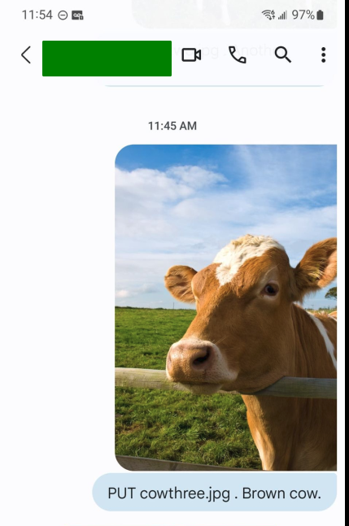
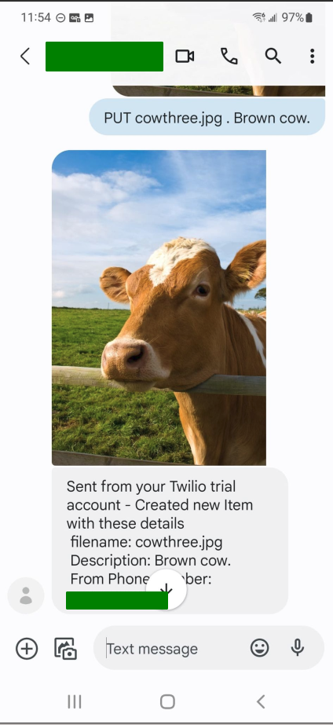
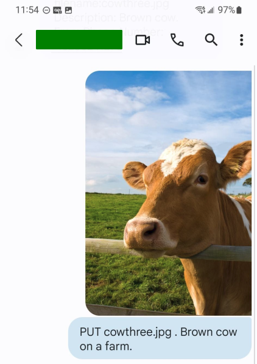
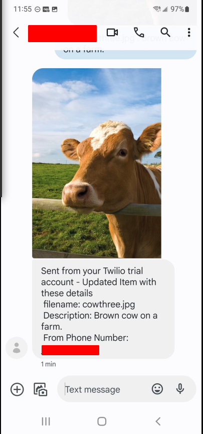

Text Image AWS Integration Project

Purpose and Introduction 
   This project was created to teach me about AWS and systems integration. 
   In general what this project does is allow a user to send a image along with details. Once the user does this, AWS will store the image in s3 and details in Dynamo DB. The user is then able to fetch the image later on. Note that if a User wants to update an image, the user can upate it by mentioning the filename again with different details and a different image.
   
Examples of Usage
Please take note of spaces when sending messages to your twilio number

Creation(Use PUT cmd)

Getting the Image(Use GET cmd)

Updating the Image (USE PUT cmd)

Architecture diagram 

Requirements
* Twilio account 
* AWS account
* Boto3

Guide For use of code 
1) Please clone the repository.
2) Create a lambda function, dynamodb Table, s3 bucket and a api gateway endpoint.
3) Create a twilio number and point the endpoints to the api gateway. 
4) Set the API Gateway fuinction to call the lambda function you created.
5) Upload the code() using aws cli to your lambda function. This is also shown in the automation script I created in python.
6) Go ahead and sending messages shown in the Examples of Usage section.

